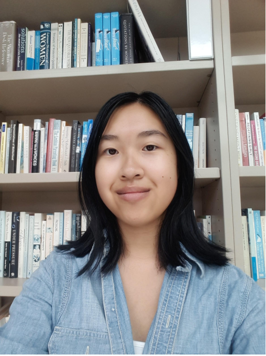

# About Me: Kim Tien Vu

| Programming Language  | Print "Hello World" |
| ------------- | ------------- |
| Java  | `System.out.println("Hello World!");`  |
| Python  | `print "Hello World"` |
| C++ | `std::cout << "Hello, world!";` |
| Bash | `echo "Hello World"` | 

**Hello World!** I am currently an undergraduate student at UCSD studying Computer Science.

## [Courses Taken](#courses-taken)
Some courses I've taken that interest me include:
- Object-Oriented Programming **with Java** 
- Algorithm Design
- Data Structures
- Database System Principles
- Computer Architecture
- Computer Vision
- Teaching Computational Thinking For Everyone

## [Hobbies](#hobbies)
I like to spend my free time doing:
1. Listening to Broadway Musicals ~~and attempting to sing them~~
2. Cooking *and eating* food!
3. Hackathons (Some of my favorite ones are below):
   - [Girls in Tech San Diego Hacking for Humanity 2019](https://devpost.com/software/govet-xnw3fy)
   - [HackXX 2019](https://devpost.com/software/food-selected-for-you)
   
I've only won 1 hackathon but like Thomas Edison says:
> I haven't failed, I've just found 10,000 ways that won't work

I also play video games but the ones I want to play that I have yet to get are:
- [ ] Little Nightmares 2
- [ ] The Last of Us Part 2
- [ ] Ark
- [ ] Cyberpunk 2077

Image from Wikipedia

## [Volunteer Work](#volunteer-work)
Some extracurricular activities of mine include:
1. Being a Programming Volunteer at the UCSD Women's Center
2. Being a UCSD JUMP Program Mentor

